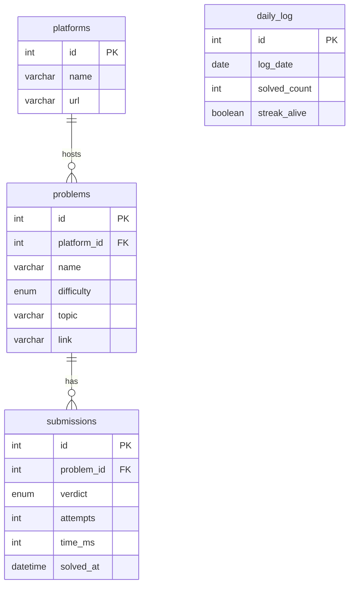

# cp-grind-tracker

tracks my competitive programming grind across LeetCode, CodeChef and Codeforces using MySQL. built as a DBMS mini project — but actually useful.

## what it does

- pulls my real LeetCode submissions via API
- stores them in a local MySQL database
- views show weak topics, difficulty breakdown, platform stats and streak history

## ER diagram


## database structure

| table | purpose |
|-------|---------|
| platforms | LeetCode, CodeChef, Codeforces |
| problems | every problem i've touched |
| submissions | every attempt — AC, WA, TLE |
| daily_log | daily solved count and streak |

## views

| view | shows |
|------|-------|
| my_performance | full submission history |
| weak_topics | topics ranked by accuracy, worst first |
| platform_stats | win rate per platform |
| difficulty_stats | easy / medium / hard breakdown |
| streak_history | day by day grind log |

## how to run

**1. setup database**
- open MySQL Workbench
- run `schemas.sql`
- run `views.sql`

**2. install dependencies**
```
pip install requests mysql-connector-python
```

**3. configure**
- open `sync.py`
- add your MySQL root password

**4. sync your leetcode data**
```
python sync.py
```

**5. query your data**
```
mysql -u root -p
USE cp_grind;
SELECT * FROM my_performance;
SELECT * FROM weak_topics;
SELECT * FROM difficulty_stats;
SELECT * FROM platform_stats;
SELECT * FROM streak_history;
```

## project files
```
cp-grind-tracker/
├── schemas.sql   — creates all 4 tables
├── views.sql     — creates all 5 views
├── queries.sql   — all SELECT queries
└── sync.py       — pulls from leetcode api into mysql
```

## tech stack

- MySQL 8.0
- Python 3
- LeetCode API via alfa-leetcode-api

---
built by [Harshith](https://github.com/Harshith1702) 🖤
